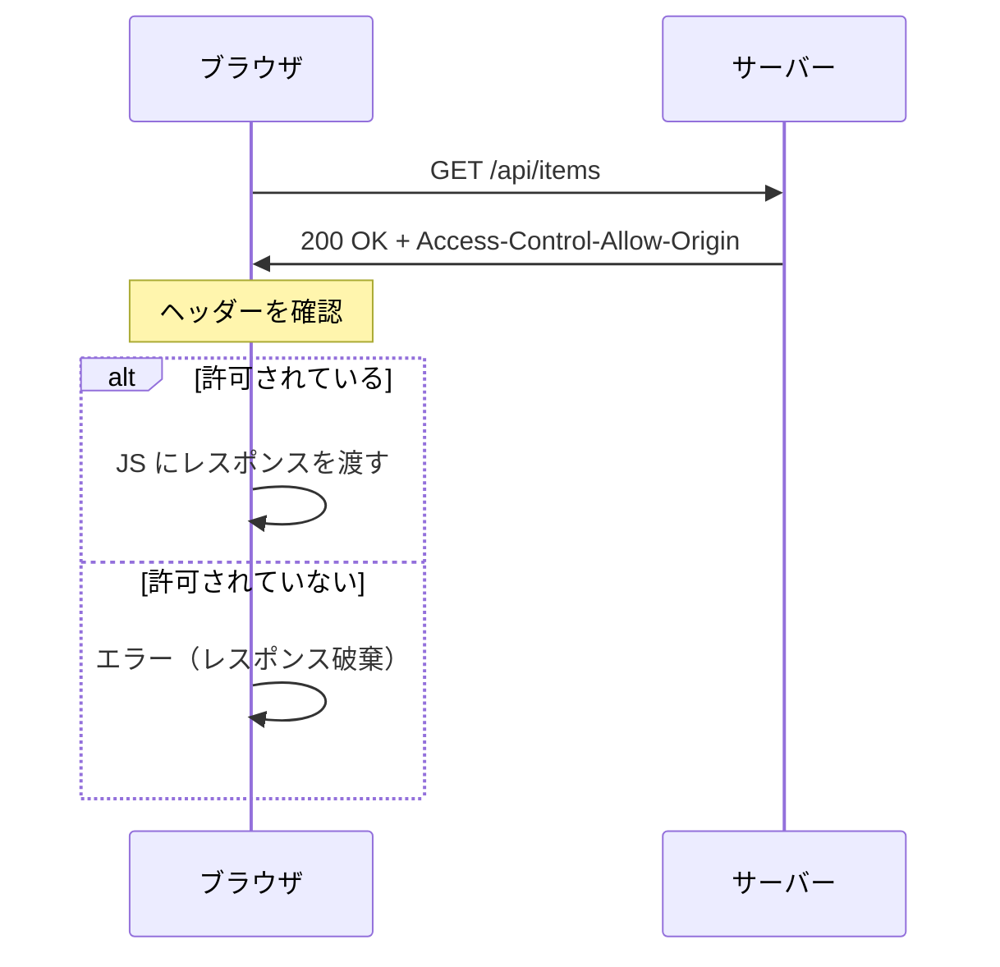
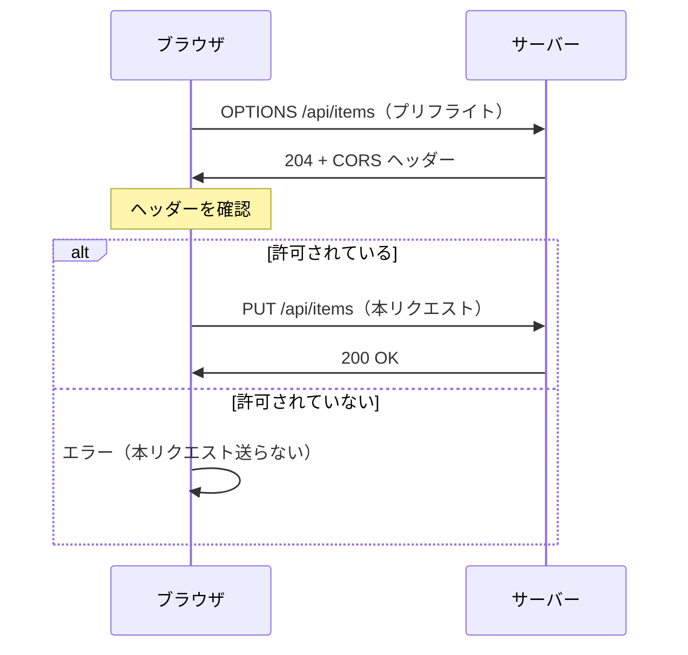

## CORS テストツール

CORS（Cross-Origin Resource Sharing）の動作を確認するためのローカルで動作するアプリ

- `front` — React + TypeScript (Vite) のフロントエンド。CORS 設定を動的に変更しながらテスト可能。
- `back` — TypeScript (Express) のバックエンド。CORS ヘッダー（OPTIONS プリフライト対応含む）を返す REST API。

## 前提

- Docker がインストールされていること
- Docker Compose がインストールされていること

## 起動方法

```bash
make up      # ビルド＆起動
make down    # 停止
```

起動後:
- Front: http://localhost:3000
- Back: http://localhost:8080

## 機能

### フロントエンド
- 各種 HTTP メソッド (GET/POST/PUT/PATCH/DELETE) でバックエンドにリクエスト
- Content-Type の切り替え（application/json / x-www-form-urlencoded）
- **バックエンドの CORS 設定をリアルタイムで変更可能**

### バックエンド CORS 設定パネル
フロントから以下を動的に変更できる:
- `enabled` — CORS ヘッダーの付与 ON/OFF
- `allowOrigin` — Access-Control-Allow-Origin
- `allowMethods` — Access-Control-Allow-Methods
- `allowHeaders` — Access-Control-Allow-Headers

### テストデータ (items)
メモリ上に保持されるテストデータを CRUD 操作可能:
- `GET /api/items` — 全件取得
- `POST /api/items` — 新規作成
- `PUT /api/items/:id` — 全置換
- `PATCH /api/items/:id` — 部分更新
- `DELETE /api/items/:id` — 削除

本来ブラウザによりコンテンツやヘッダーがキャッシュされるが、このアプリではキャッシュを無視してリクエストを送信する。

---

## CORS について

CORS（Cross-Origin Resource Sharing）は、ブラウザが異なるオリジン間でリソースを共有する際のセキュリティ機構。

### オリジンとは

`スキーム + ホスト + ポート` の組み合わせ。以下は全て異なるオリジン:

- `http://localhost:3000`
- `http://localhost:8080`（ポートが違う）
- `https://localhost:3000`（スキームが違う）

### リクエストの種類

**1. Simple Request（単純リクエスト）**

プリフライトなしで直接送信される。条件:
- メソッド: GET, HEAD, POST のみ
- Content-Type: `text/plain`, `multipart/form-data`, `application/x-www-form-urlencoded` のみ
- ヘッダー：`Accept`, `Accept-Language`, `Content-Language`, `Content-Type`, `Range` のみ



**2. Preflight Request（プリフライトリクエスト）**

本リクエストの前に OPTIONS で許可を確認。以下の場合に発生:
- PUT, DELETE, PATCH などのメソッド
- カスタムヘッダー（Authorization など）
- `Content-Type: application/json`



### 主要な CORS ヘッダー

| ヘッダー | 役割 |
|---------|------|
| `Access-Control-Allow-Origin` | 許可するオリジン（`*` で全許可） |
| `Access-Control-Allow-Methods` | 許可するメソッド |
| `Access-Control-Allow-Headers` | 許可するヘッダー |
| `Access-Control-Allow-Credentials` | Cookie 送信許可 |
| `Access-Control-Max-Age` | プリフライト結果のキャッシュ秒数 |

---

## AWS での CORS 対応（参考）

| サービス | CORS 対応 | プリフライト (OPTIONS) |
|---------|----------|----------------------|
| ECS / Fargate | ❌ なし | アプリで処理 |
| ALB | ❌ なし | アプリで処理 |
| API Gateway | ✅ 設定可能 | 自動応答 |
| CloudFront | ✅ ヘッダー付与のみ | アプリで処理 |

### API Gateway の場合

CORS を有効にすると、プリフライト用の OPTIONS レスポンスを自動生成。バックエンドにリクエストを転送せずに API Gateway が直接応答する。

```
[ブラウザ] --OPTIONS--> [API Gateway] ← ここで応答（バックエンド不要）
[ブラウザ] --GET------> [API Gateway] --> [ECS]
```

### CloudFront の場合

レスポンスヘッダーポリシーで CORS ヘッダーを付与できるが、OPTIONS リクエストはオリジン（ALB/ECS）に転送される。アプリ側で OPTIONS を処理する必要あり。

```
[ブラウザ] --OPTIONS--> [CloudFront] --> [ALB] --> [ECS] ← アプリで処理
[ブラウザ] --GET------> [CloudFront] --> [ALB] --> [ECS]
```
